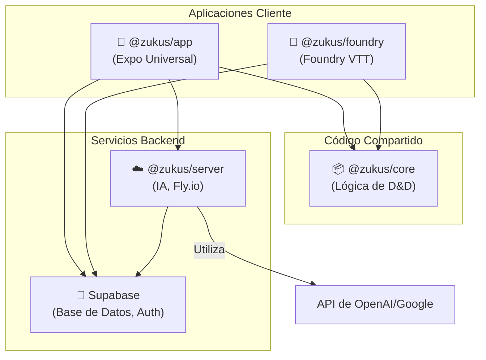

# Análisis de Arquitectura: Monorepo Zukus

Este informe detalla la estructura, componentes y relaciones dentro del monorepo del proyecto Zukus, ubicado en `/Users/cilveti/personal/zukus`.

## 1. Visión General y Arquitectura

El proyecto Zukus está estructurado como un **monorepo** gestionado con **Turborepo** y **Bun**. Su objetivo es crear un ecosistema de herramientas para Dungeons & Dragons, compartiendo una lógica central a través de diferentes aplicaciones cliente.

La arquitectura sigue un patrón clásico de monorepo, separando las aplicaciones (puntos de entrada para el usuario) de los paquetes de código compartido.

-   **Gestor de Tareas**: `Turborepo`
-   **Entorno de Ejecución y Gestor de Paquetes**: `Bun`
-   **Lenguaje Principal**: `TypeScript`

## 2. Archivos de Configuración Clave

### `package.json` (raíz)

-   Define los **workspaces** del monorepo en los directorios `apps/*` y `packages/*`.
-   Centraliza los scripts principales (`build`, `dev`, `lint`, `test`), que son delegados a Turborepo.
-   Establece `bun` como el `packageManager`.
-   Incluye un script `deploy:server` para desplegar el backend en `Fly.io`.

### `turbo.json`

-   Orquesta las tareas a través de todo el monorepo.
-   Define una pipeline de dependencias estándar: tareas como `build`, `test` y `typecheck` dependen de la finalización de la tarea `build` en los paquetes de los que dependen (`"dependsOn": ["^build"]`).
-   Configura el cacheo de artefactos de compilación (`.expo/`, `dist/`, `.next/`) para acelerar los builds incrementales.
-   La tarea `dev` está configurada como `persistent` y sin caché, ideal para servidores de desarrollo.

## 3. Estructura de Componentes

El monorepo está organizado en dos directorios principales: `apps/` para las aplicaciones y `packages/` para el código compartido.

### `packages/` - Código Compartido

Solo existe un paquete, que es el núcleo del sistema:

#### 📦 `@zukus/core`

-   **Propósito**: Es el "cerebro" del proyecto. Contiene toda la lógica de negocio y las reglas del sistema de D&D (personajes, hechizos, dados, objetos).
-   **Tecnología**: Es un paquete de TypeScript puro, sin dependencias de UI, lo que lo hace agnóstico a la plataforma.
-   **Dependencias Notables**: `zod` para la validación de esquemas de datos y `lodash` para utilidades.
-   **Rol**: Sirve como la única fuente de verdad para la lógica del juego, y es consumido por todas las aplicaciones del monorepo.

### `apps/` - Aplicaciones Cliente

Contiene tres aplicaciones distintas que actúan como puntos de entrada para los usuarios.

#### 📱 `@zukus/app`

-   **Propósito**: Es la aplicación cliente principal y universal.
-   **Tecnología**: Construida con **Expo** y **React Native**, lo que le permite compilar para iOS, Android, Web e incluso Desktop (usando un wrapper de **Tauri**).
-   **UI**: Utiliza el framework **Tamagui** para componentes de interfaz de usuario multiplataforma.
-   **Gestión de Estado**: **Zustand**.
-   **Dependencias Clave**: Depende directamente de `@zukus/core` para toda la lógica del juego y se conecta a **Supabase** como backend principal. También integra hardware específico como los dados `Systemic Pixels`.

#### ☁️ `@zukus/server`

-   **Propósito**: Un microservicio backend especializado en funcionalidades de Inteligencia Artificial.
-   **Tecnología**: Servidor **Bun** en TypeScript, diseñado para ser rápido y eficiente.
-   **Funcionalidad**: Utiliza las librerías `@ai-sdk/google` y `openai`, indicando que procesa o genera contenido a través de modelos de lenguaje.
-   **Despliegue**: Se despliega en **Fly.io**.
-   **Rol**: Actúa probablemente como un *Backend for Frontend* (BFF) o un servicio auxiliar que la `@zukus/app` puede consultar para tareas de IA, manteniendo las claves de API seguras en el servidor.

#### 🎲 `@zukus/foundry`

-   **Propósito**: Una integración del sistema Zukus para la plataforma **Foundry VTT** (Virtual Tabletop).
-   **Tecnología**: Es un sistema para FoundryVTT que utiliza **Vite** para su proceso de compilación.
-   **Rol**: Adapta la lógica de `@zukus/core` para que funcione dentro de Foundry. Esto permite a los usuarios utilizar las reglas y cálculos de Zukus en sus partidas de FoundryVTT. También se conecta a **Supabase**, sugiriendo una posible sincronización de datos entre plataformas.

## 4. Relaciones y Flujo de Datos

La arquitectura está diseñada para maximizar la reutilización de código.

-   **`@zukus/core` es central**: Tanto la aplicación principal como la integración de Foundry dependen de él, evitando la duplicación de la lógica del juego.
-   **Supabase como Backend Principal**: Todas las aplicaciones (incluido el servidor de IA) parecen utilizar Supabase como su base de datos y backend principal para datos CRUD y autenticación.
-   **Servidor de IA como servicio especializado**: `@zukus/server` no es el backend principal, sino un servicio que ofrece capacidades de IA a la aplicación principal, probablemente para tareas como generación de contenido, resúmenes, etc.

## 5. Conclusión

El monorepo de Zukus está bien estructurado y aprovecha eficazmente las ventajas de esta arquitectura. La clara separación entre la lógica central (`@zukus/core`) y las implementaciones de la interfaz de usuario (`@zukus/app`, `@zukus/foundry`) permite un desarrollo modular, mantenible y escalable. El uso de Turborepo y Bun proporciona una experiencia de desarrollo moderna y de alto rendimiento.
